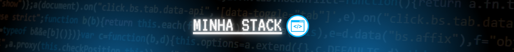
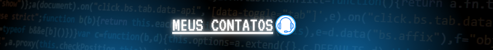
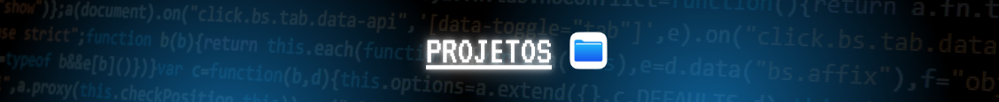

  
  

  

   
<ul>
  <li>🤩️ Gosto de ouvir musica enquanto estou programando</li>
  <li>💻 <b>Estudando</b> na <a href="https://unifan.net.br/" target="blank">Unifan</a> Analise e Desenvolvimento de Sistemas </li>
  <li>🔭 Com mais de 2 anos de <b>experiência</b> em programação Front, Back, e Mobile</li>
  <li>🚀 Evoluindo continuamente em <strong>C#</strong> e em seu ecossistema.</li>
  <li>🇺🇸 Tenho inglês intermediário.</li>
</ul>
  

<table align="right" height="255px">
  <tr>
     <td align="center">
      <a  target="_blank" href="https://www.javascript.com/">
         
        
          <b>
            <pre>JavaScript</pre>
          </b>
        
      </a>
    </td>
     <td align="center">
      <a  target="_blank" href="https://www.typescriptlang.org/">
         
        
          <b>
            <pre>TypeScript</pre>
          </b>
        
      </a>
    </td>
    <td align="center">
      <a  target="_blank" href="https://dart.dev/">
         
        
          <b>
            <pre>Dart</pre>
          </b>
        
      </a>
    </td>
    <td align="center">
      <a>
         
        
          <b>
            <pre>C</pre>
          </b>
        
      </a>
    </td>
    <td align="center">
      <a  target="_blank" href="https://www.python.org/">
         
        
          <b>
            <pre>Python</pre>
          </b>
        
      </a>
    </td>
  </tr>
<!-- ////////////////////////////////////////////////// -->
    <tr>
    <td align="center">
      <a  target="_blank" href="https://tailwindcss.com/">
       
      
        <b>
          <pre>Tailwind CSS</pre>
        </b>
      
      </a>
    </td>
    <td align="center">
      <a  target="_blank" href="https://developer.mozilla.org/pt-BR/docs/Learn/Getting_started_with_the_web/CSS_basics">
       
      
        <b>
          <pre>CSS</pre>
        </b>
      
      </a>
    </td>
    <td align="center">
      <a  target="_blank" href="https://styled-components.com/">
         
        
          <b>
            <pre>Styled Components</pre>
          </b>
        
      </a>
    </td>
    <td align="center">
      <a  target="_blank" href="https://getbootstrap.com/">
       
      
        <b>
          <pre>Bootstrap</pre>
        </b>
      
      </a>
    </td>
  </tr>
  <!-- ////////////////////////////////////////////////// -->
  <tr>
    <td align="center">
      <a  target="_blank" href="https://react.dev/">
         
        
          <b>
            <pre>React.js</pre>
          </b>
        
      </a>
    </td>
    <td align="center">
      <a  target="_blank" href="https://vuejs.org/">
         
        
          <b>
            <pre>Vue.js</pre>
          </b>
       </a>
      
    </td>
    <td align="center">
      <a  target="_blank" href="https://nextjs.org/">
       
      
        <b>
          <pre>Next.js</pre>
        </b>
      
      </a>
    </td>
    <td align="center">
      <a  target="_blank" href="https://vitejs.dev/">
         
        
          <b>
            <pre>Vite.js</pre>
          </b>
        
      </a>
    </td>
    <td align="center">
      <a>
         
        
          <b>
            <pre>Html</pre>
          </b>
        
      </a>
    </td>
  </tr>
  <tr>
    <td align="center">
      <a  target="_blank" href="https://reactnative.dev/">
         
        
          <b>
            <pre>React Native</pre>
          </b>
        
      </a>
    </td>
    <td align="center">
      <a  target="_blank" href="https://flutter.dev/">
         
        
          <b>
            <pre>Flutter</pre>
          </b>
        
      </a>
    </td>
    <td align="center">
      <a  target="_blank" href="https://kotlinlang.org/">
         
        
          <b>
            <pre>Kotlin</pre>
          </b>
        
      </a>
    </td>
  </tr>
  <tr>
    <td align="center">
      <a  target="_blank" href="https://nodejs.org/en">
       
      
        <b>
          <pre>Node.js</pre>
        </b>
      
      </a>
    </td>
    <td align="center">
      <a  target="_blank" href="https://expressjs.com/pt-br/">
         
        
          <b>
            <pre>Express.js</pre>
          </b>
        
      </a>
    </td>
    <td align="center">
      <a  target="_blank" href="https://fastify.dev/">
         
        
          <b>
            <pre>Fastfy</pre>
          </b>
        
      </a>
    </td>
    <td align="center">
      <a  target="_blank" href="https://nestjs.com/">
         
        
          <b>
            <pre>Nest.js</pre>
          </b>
        
      </a>
    </td>
    <td align="center">
      <a  target="_blank" href="https://graphql.org/">
         
        
          <b>
            <pre>GraphQL</pre>
          </b>
        
      </a>
    </td>
  </tr>
  <tr>
    <td align="center">
      <a  target="_blank" href="https://www.mysql.com/">
         
        
          <b>
            <pre>MySQL</pre>
          </b>
        
      </a>
    </td>
    <td align="center">
      <a  target="_blank" href="https://www.postgresql.org/">
         
        
          <b>
            <pre>PostGreSQL</pre>
          </b>
        
      </a>
    </td>
    <td align="center">
      <a  target="_blank" href="https://www.prisma.io/">
         
        
          <b>
            <pre>Prisma</pre>
          </b>
        
      </a>
    </td>
   <td align="center">
      <a  target="_blank" href="https://firebase.google.com/?hl=pt">
         
        
          <b>
            <pre>Firebase</pre>
          </b>
        
      </a>
    </td>
  </tr>
  <tr>
   <td align="center">
      <a  target="_blank" href="https://tauri.app/">
         
        
          <b>
            <pre>Tauri</pre>
          </b>
        
      </a>
    </td>
    <td align="center">
      <a  target="_blank" href="https://www.electronjs.org/pt/">
         
        
          <b>
            <pre>Electron</pre>
          </b>
        
      </a>
    </td>
    <td align="center">
      <a  target="_blank" href="https://threejs.org/">
         
        
          <b>
            <pre>Three.js</pre>
          </b>
        
      </a>
    </td>
  </tr>
</table>
            

  

  <a  href="mailto:ikaroassis08gmail.com" target="_blank">
    
    Gmail
    &nbsp;
  </a>
  <a href="https://wa.me/5575982999575" target="_blank">
    
    Whatsapp
    &nbsp;
  </a>
  <a href="https://www.instagram.com/duck.web/" target="_blank">
    
    Instagram
    &nbsp;
  </a>

  
   

